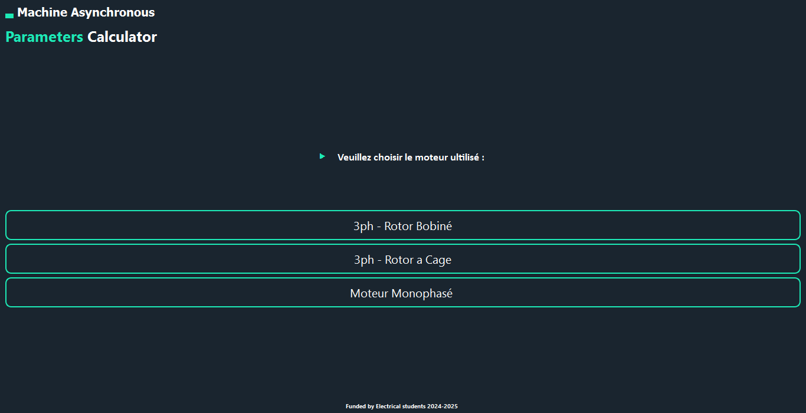
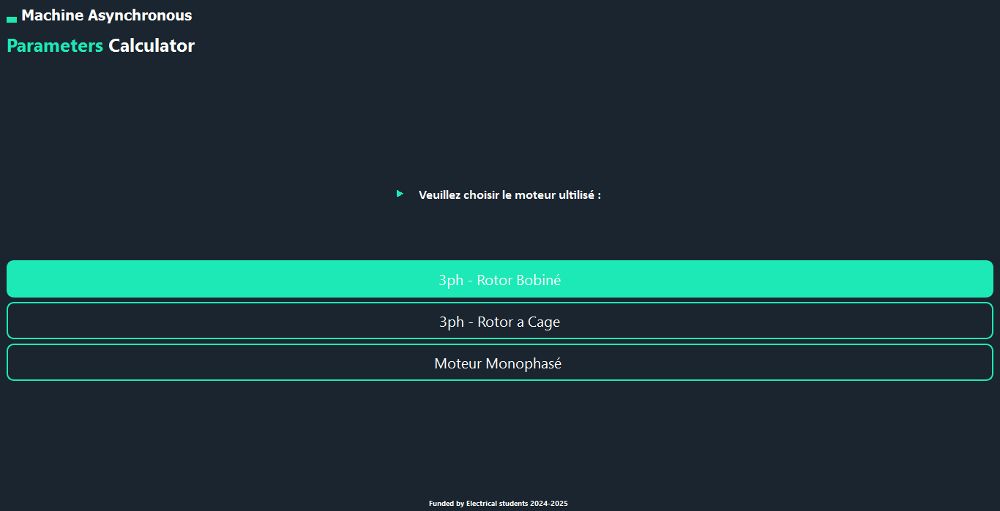
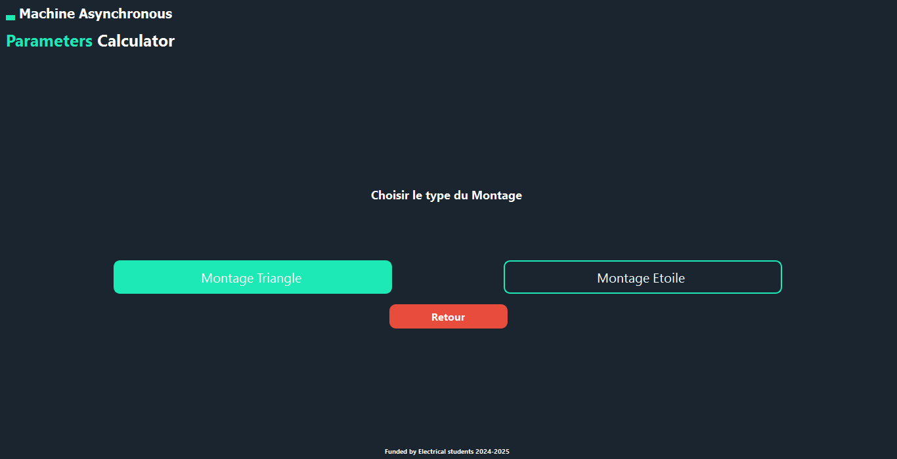
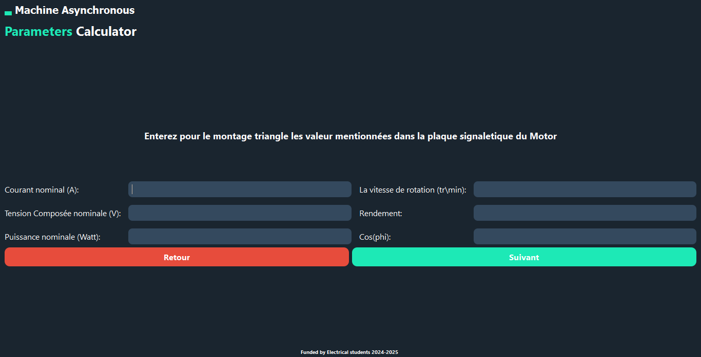
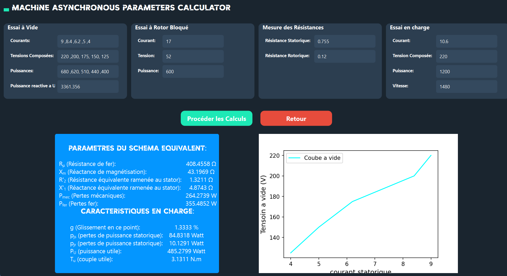
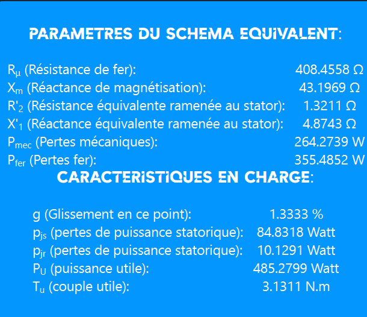

# Asynchronous-Machine-Parameters-Calculator
The developed application calculates the equivalent-circuit parameters of an induction motor from experimental test data, including the no-load and blocked-rotor tests. Implemented in Python using PyQt6, it provides a simple interface for motor selection, experimental data entry, and parameter calculation.

**P.S.: The RAR file contains a video demonstrating the application’s functionality.**

<h2>Motor Selection and Configuration</h2>

The user selects the motor type and electrical configuration.

<h2>Motor Nameplate Data</h2>

The motor configuration and nominal nameplate data are entered to define the 
<b>nominal operating point</b> for the calculations.

<h2>Experimental Tests</h2>

The application uses <b>no-load</b> and <b>locked-rotor tests</b> to determine 
the equivalent-circuit parameters and operating characteristics of the motor.

<h2>Application Output</h2>

After processing the input and experimental data, the application calculates the 
<b>equivalent-circuit parameters</b> of the induction motor and evaluates its 
electrical and mechanical performance under different operating conditions.

